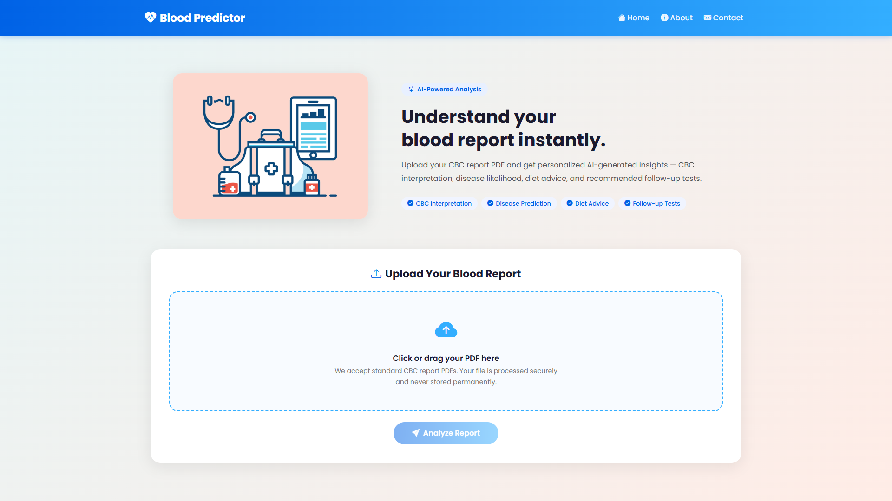
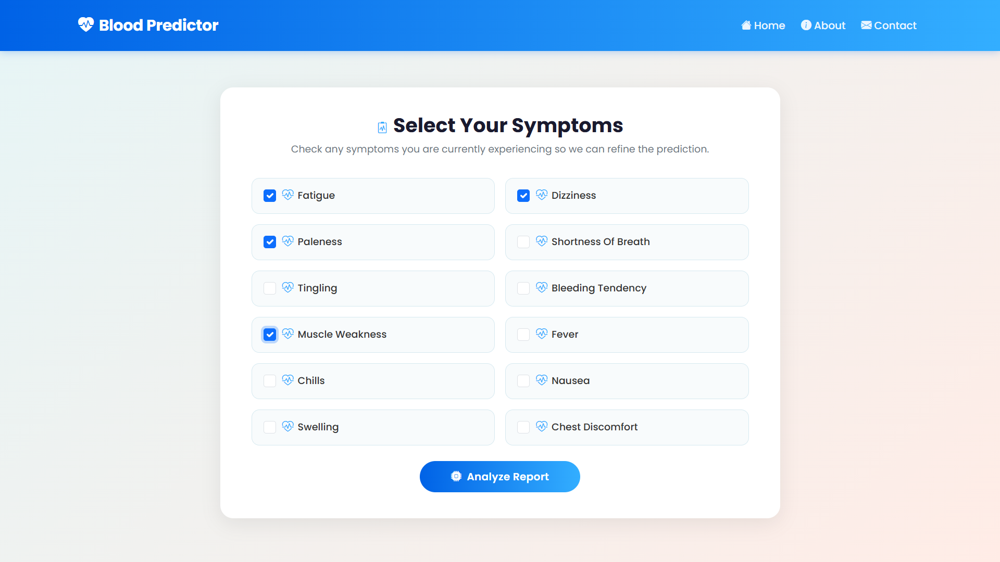
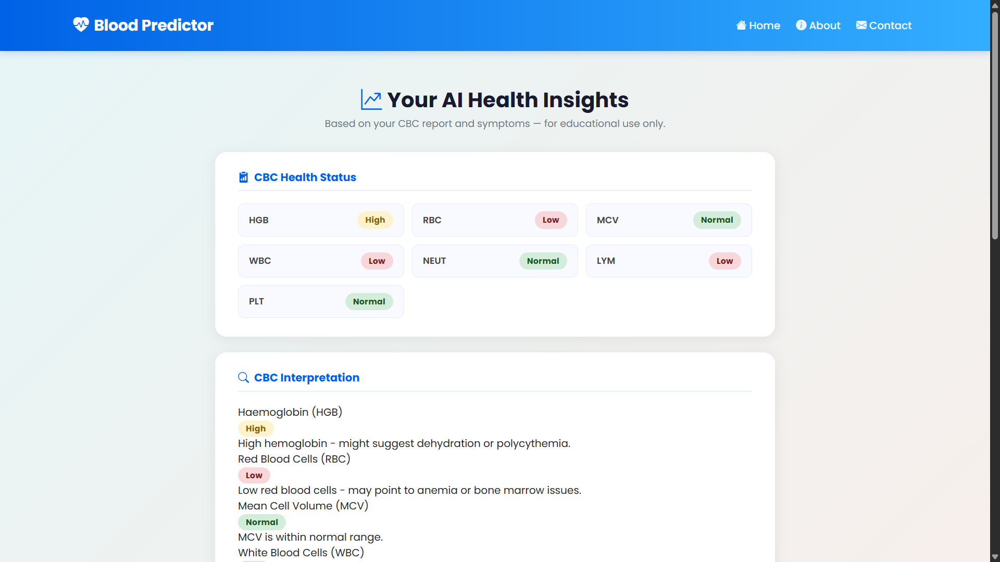
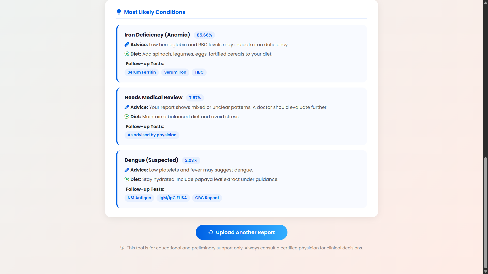
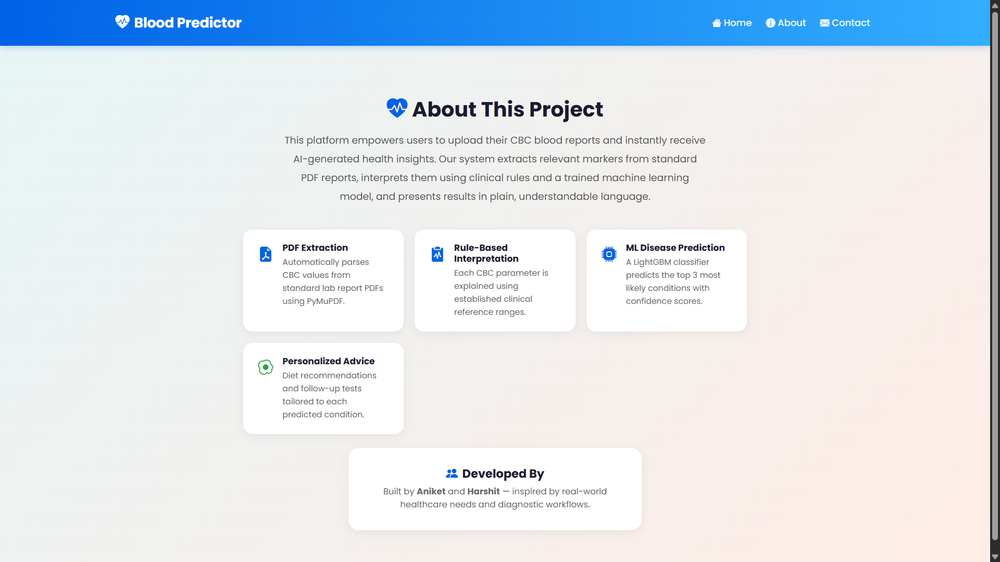

# 🩸 AI-Powered Medical CBC Report Summariser & Disease Predictor

An intelligent diagnostic system that interprets Complete Blood Count (CBC) test results from uploaded PDF reports, combines them with user-input symptoms, and uses Machine Learning to identify possible conditions. The system explains abnormal test parameters, recommends diets, and suggests follow-up tests in plain, patient-friendly language.

---

## ✨ Features

- **Automated PDF Parsing**: Upload your CBC report (PDF), and the system automatically extracts lab values.
- **Rule-based CBC Parameter Explanation**: Clinically-aligned rules interpret each parameter (e.g., Low, Normal, High) and explain what it means.
- **ML-based Disease Prediction**: A trained LightGBM classifier predicts the top possible diseases based on both CBC parameters and symptoms.
- **Actionable Recommendations**: Provides tailored medical advice, dietary suggestions, and follow-up tests for predicted conditions.
- **Dual Interface**: Offers a user-friendly Django web application and a CLI script for quick testing.

---

## 📸 Screenshots

Here is a glimpse of the application in action:

| Home | Symptoms | Results 1 |
|:---:|:---:|:---:|
|  |  |  |

| Results 2 | About | Contact |
|:---:|:---:|:---:|
|  |  |  |

---

## 🛠️ Technology Stack

- **Backend / Web Framework**: Django, Python
- **Machine Learning**: LightGBM, Scikit-learn, Pandas, NumPy
- **PDF Extraction**: PyMuPDF
- **Frontend**: HTML/CSS (Django Templates)

---

## 📂 Project Structure

```text
Medical_CBC_Report_Summariser/
├── app.py                      # Command Line Interface (CLI) testing script
├── manage.py                   # Django management script
├── bloodpredictor/             # Django core project configuration
├── predictor/                  # Django web application (views, templates, urls)
├── data/                       
│   ├── config/                 # Clinical rules and model configuration JSONs
│   └── processed/              # Datasets used for training
├── models/                     # Trained LightGBM model & Encoders
├── scripts/                    # Utility scripts (synthetic dataset generation, etc.)
├── utils/                      # Helper modules (PDF parsing, rule-based logic)
├── requirements.txt            # Python dependencies
└── README.md                   # Project documentation
```

---

## ⚙️ Setup & Installation

### 1. Clone the repository
```bash
git clone https://github.com/Ani2027/Medical_CBC_Report_Summariser.git
cd Medical_CBC_Report_Summariser
```

### 2. Create a Virtual Environment
```bash
python -m venv .venv
# On Windows
.venv\Scripts\activate
# On Mac/Linux
source .venv/bin/activate
```

### 3. Install Dependencies
```bash
pip install -r requirements.txt
```

### 4. Run the Web Application
```bash
python manage.py runserver
```
Visit `http://127.0.0.1:8000` in your browser.

---

## 🚀 How to Use

### Web Interface
1. **Upload Report**: Navigate to the homepage and upload a CBC blood test report (PDF).
2. **Add Symptoms**: After extraction, check the boxes for any symptoms you are currently experiencing (e.g., Fever, Fatigue, Nausea).
3. **View Diagnosis**: Click Predict to get a plain-English summary of your CBC results, the top predicted conditions, diet recommendations, and follow-up tests.

### Command Line Interface (CLI)
You can test the core logic without starting the server by running the CLI script:
```bash
python app.py
```
*Note: You can modify the `input_dict` inside `app.py` to test different CBC values and symptoms manually.*

---

## 🧠 How It Works (Under the Hood)

1. **PDF Processing**: `utils/pdf_parser.py` uses PyMuPDF to extract text from the lab report, identifying key CBC parameters (HGB, RBC, WBC, etc.) and classifying their statuses (Low, Normal, High).
2. **Rule-Based Interpretation**: `utils/analyze_parameters.py` checks these statuses against `data/config/cbc_interpretation_rules.json` to generate human-readable explanations.
3. **ML Prediction Pipeline**: `models/predictor.py` takes the combined CBC statuses and boolean symptoms (0 or 1), passes them through the trained LightGBM model, and returns the top 3 most likely diseases along with medical advice and diet suggestions.

---

## 🗂️ Dataset Coverage

The model is trained to recognize 15+ conditions including:  
- Anemia, Dengue, Malaria, Typhoid  
- Viral/Bacterial infections, Sepsis, Pancytopenia  
- Immunity issues, Nutritional deficiencies, and more  

---

## ⚠️ Disclaimer

This tool is **not a diagnostic device**. It is intended for **educational and preliminary support** only. Always consult a certified physician or healthcare professional for clinical decisions and accurate diagnosis.

---

## 👨‍💻 Developed By

Built by **Aniket** and **Harshit**  
*Inspired by real-world healthcare needs and diagnostic workflows.*
